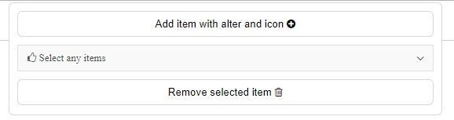
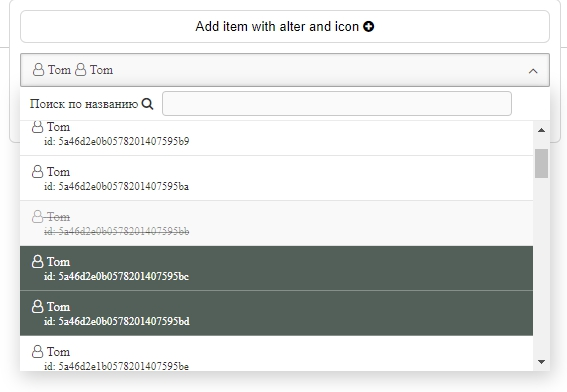

# ox-select


> Smart multiselect for ReactiveForms and simple using
>
> Умный мультиселект для реактивных форм и обычного использования






## Install/Установка

```
npm install ox-select
```

**For icons install font-awesome or ionic icons pack**  
**Для работы иконок установите font-awesome или ionic пакеты**  

```
npm install font-awesome --save

...//angular-cli.json
"apps": [
          {
             "root": "src",
             "outDir": "dist",
             ....
             "styles": [
                "styles.css",
                "../node_modules/font-awesome/css/font-awesome.css"
             ],
             ...
         }
       ]

],
...
```

## Using/Использование

import module where will you use select:  
Добавьте модуль в ваш проект, там где будете использовать select:  

```
import { OxSelectModule } from 'ox-select';

...

@NgModule({
  imports: [
    
    ...
    OxSelectModule
  ],

...
```

> If you have error/Если имеется ошибка:
> > Module not found: Error...
> add link to index.ts file of OxSelectModule/Добавьте ссылку до index.ts файла модуля OxSelectModule


```//tsconfig.json
{
  "compileOnSave": false,
  "compilerOptions": {
    "outDir": "./dist/out-tsc",
    "sourceMap": true,
    "declaration": false,
    "moduleResolution": "node",
    "emitDecoratorMetadata": true,
    "experimentalDecorators": true,
    "target": "es5",
    "typeRoots": [
      "node_modules/@types"
    ],
    "lib": [
      "es2017",
      "dom"
    ]
  },
  "include": [
    "src/**/*",
    "node_modules/ox-select/index.ts"
  ]
}
```

Add tag <ox-select> with any attributs your need into html-template (all attributes not required)  
Добавьте тэг <ox-select> с любыми требуемыми для Вас аттрибутами (все атрибуты необязательные)  


```
  <ox-select
    [filterSelect]="true"
    [filterTitle]="'Search in list'"
    [multySelect]="true"
    [inputData]="items"
    [defaultData]="'No Items'"
    [headerTitle]="'Select any items'"
    [headerIcon]="'fa fa-thumbs-o-up'"
    [styleSelect]="{
      margin: '0px 10px',
      width: 'calc(100% - 20px)'
    }"
    (outputData)=select($event, 'select-items')>
  </ox-select>

  or/или

  <ox-select
    [inputData]="[
        {
            input: 'check 1',
            output: 1,
            icon: 'fa fa-user-plus'
        },
        {
            input: 'check 2',
            output: 2,
            alter: [
                key: 'description',
                value: 'not check it!'
            ]
        },
        {
            input: 'check 3',
            output: 3,
            selected: true
        },
        {
            input: 'check 4'
            output: 4,
            disabled: true
        }
    ]"
    (outputData)=select($event, 'check-item')>
  </ox-select>

```


-alter attr-  
**filterSelect** - add filter for searching / Добавляет поле с поиском  
**filterTitle** - text of filter / текст фильтра   
**multySelect** - switch on multiselect mode / Включает режим с множественным выбором  
**defaultData** - text when haven't options / Текст когда нет опций  
**headerTitle** - text when have no selected options yet / Текст когда еще ничего не выбрано из списка опций  
**headerIcon** - icon before headerTitle / иконка перед headerTitle  
**styleSelect** - use like ngStyle for box of select / работает как ngStyle для вьюхи select  

-main attr-  
**inputData** - input data :) / Входящие данные  
**outputData** - output data / Выходящие данные  

Input data must be array of object by next style:  
Входящие данные должны быть массивом объектов следующего вида:  

```
this.method.selectUsers().subscribe(
    res => {
        this.items = res.map((select: any)=>{
            return {
                input: select.name,
                output: select.id,
                icon: 'fa fa-user-o',
                disabled: select._id == '5a46d2e0b0578201407595bb',
                selected: select._id == '5a46d2e0b0578201407595bd',
                alter: [
                    {
                    key: 'id',
                    value: select.id
                    }
                ]
            }
        });
    }, 
    error => {
        console.log(error);
    }
);

```

where / где:  

-required/обязательные-  

**input** - like `<option>Input</option> `/ как `<option>Input</option>`  
**output** - like value in `<option value="output">` / как value в `<option value="output">`  

-additional/дополнительные-  

**icon** - icon before input's text / иконка перед текстом input  
**disabled** - like `<option disabled>` / как `<option disabled>`   
**selected** - like `<option selected>` / как `<option selected>`   
**alter** - one of more descriptions / одно или более описаний:  

```
...
alter: [
    {
        key: 'id',
        value: user.id
    },
    {
        key: 'created',
        value: user.created
    },
    {
        key: 'age',
        value: user.age
    }
]
...
```

Output data listen event of select and call shown method where $event is array  
Выходные данные прослушиваются в outputData и вызывают указанный метод где $event - это массив   

example/ к примеру:  

```
private form: FormGroup = this.fb.group({
    'check-item': '',
    'select-items': ''
});

private select(data, name) {
    this.form.get(name).setValue(data);
}

```
